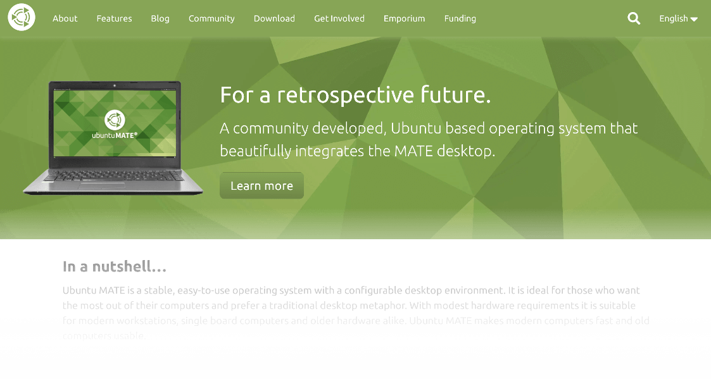

# ubuntu-mate.org

The website for discovering and downloading the Ubuntu MATE operating system.

Powered by [Jekyll](https://jekyllrb.com/), a static site generator.

## Getting Started

See [EDITING.md](EDITING.md) for notes on adding/editing pages on this website.

### Edit on GitHub

The easiest way to edit ubuntu-mate.org is to use GitHub to edit the page.
Simply find the page you want and create a pull request!

**Translators,** please see the [Translations](#Translations) section instead.

### Edit Locally

Install [Jekyll](https://jekyllrb.com) as follows:

    sudo apt install ruby ruby-dev make gcc
    sudo gem install jekyll bundler

To install gem dependencies for the project;

    bundle install

Some additional packages are needed to build the project:

    sudo apt install python3-yaml transmission-cli python3-polib

To watch for changes locally:

    ./scripts/watch.sh

The first build may take a while to complete, but will be substantially faster
afterwards.

You can preview the website on your computer at http://localhost:4000.

## Building

This website has a few programmatically generated files, such as localized pages
and automatic magnet link generation for torrents. These can be enabled by passing
the parameters to either `build.sh` or `watch.sh`

| Parameter     | What it does                                              |
| ------------- | --------------------------------------------------------- |
| --magnet-uri  | Fetch torrent files and generate magnet links.
| --locales     | Build localized pages.

For example:

    ./scripts/build.sh --locales --magnet-uri

## Testing

Continuous Integration will perform validation checks to ensure the website
maintains a high quality standard for visitors around the world. Before running
tests on your local machine, install the Ruby gem:

    gem install html-proofer

Then thereon after, you may run:

    ./scripts/test.sh

This will check internal links, images and page metadata for errors.

From time to time, you may wish to run the test with `--external` to check
links to other websites, blogs or people pages in case of [link rot](https://en.wikipedia.org/wiki/Link_rot).

## Translations

We are ready to speak multiple languages! Visit
[Transifex](https://www.transifex.com/ubuntu-mate/ubuntu-mate.org/)
to translate this website. The Ubuntu MATE team will pull in completed translations.

Please refer to the [guidelines](https://ubuntu-mate.community/t/22342) for
the best practices.

We use the [polyglot](https://github.com/untra/polyglot) gem to provide i18n support.

As part of the build script, the website will generate the markdown files for other
languages via `scripts/manage-translations.py`. This can be ran manually too:

| Parameter             | Action                                            |
|-----------------------|---------------------------------------------------|
| `--generate`          | Creates POT and updates PO files from pages.
| `--build`             | Process translated PO files for use with Jekyll.

When pages change, run `--generate`. Before building the site, run `--build`.

Language lists are to be updated in:

* `_i18n/locales.txt`
* `_config.yml` (under `languages:`)
* `_data/lang.yml`

## File Structure

### Content Editor

| Folder            | Purpose
|-------------------|-------------------------------------------------------|
| `_data`           | Structured YAML data used for things like download lists.
| `_drafts`         | Blog posts (markdown) not ready to publish. Use `--drafts` parameter to preview.
| `images`          | Images used across the site.
| `pages`           | Page contents (markdown)
| `_posts`          | Blog posts (markdown)

### Development

| Folder            | Purpose
|-------------------|-------------------------------------------------------|
| `_includes`       | HTML to build up sections of the website.
| `_layouts`        | HTML base layouts.
| `_sass`           | Ubuntu MATE theme
| `assets`          | Global website resources, like favicons and libraries.
| `scripts`         | For building and deployment.

### Other

| Folder            | Purpose
|-------------------|------------------------------------------------------|
| `_i18n`           | Source files (.pot, .po) for translating.
| `redirects`       | Meta redirects from legacy links.

## License

Refer to the [LICENSE.md](LICENSE.md) file for copyright and licensing notices
for this website.
